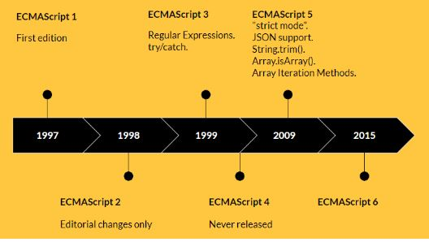

# AULA 01 - O QUE É JAVASCRIPT
## História
### Características da linguagem:
* JS é uma linguagem interpretada, ou seja, o browser roda a linguagem em tempo real
* Baseada em protótipos
* Multiparadigma
* Comumente utilizada em aplicações web client-side
* Segue o padrão ECMAScript

## Evoloução

## Aplicações
* Web
* Mobile
* Smartwatches
* Games
* Internet of Things
* APIS