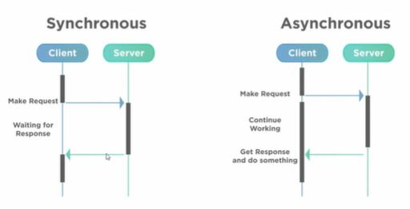
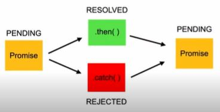
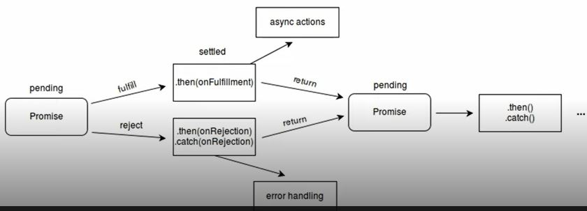

# AULA 1 - DEFINIÇÃO, PROMISES E ASYNC/AWAIT
## Definição:
 Assíncrono: Que não ocorre ou não se efetiva ao mesmo tempo.
 O JavaScrípt roda de maneira síncrona.



## Promises:
Ojeto de processamento assíncrono.
Inicialmente, seu valor é desconhecido. Ela pode, então, ser resolvida ou rejeitada.



Uma promise pode ter 3 estados:
  - Pending
  - Fulfilled
  - Rejected



Estrutura de uma promise:
```
const myPromise = new Promise((resolve, reject) => {
  window.setTimeout(() => {
    resolve(console.log('Resolvida!'));
  }, 2000);
});
```

Manipulação de uma promisse:
```
const myPromise = new Promise((resolve, reject) => {
  window.setTimeout(() => {
    resolve(console.log('Resolvida!'));
  }, 2000);
});

await myPromise
  .then((result) => result + 'passando pelo then')
  .then((result) => result + 'e agora acabou!')
  .catch((err) => console.log(err.message));

// Após 2 segundos, retornará o valor:
// "Resolvida passando pelo then e agora acaboy!"
```

## Async/ await:
Funções assícronas precisam dessas duas palavras chaves

```
async function resolvePromise() {
  const myPromise = new Promise((resolve, reject) => {
    window.setTimeout(() => {
      resolve('Resolvida);
    }, 3000);
  });

  const resolved = await myPromise
    .then((result) => result + 'passando pelo then')
    .then((result) => result + 'e agora acabou!')
    .catch((err) => console.log(err.message));
  
  return resolved;
}
```

Funções assíncronas também retornam Promises!

Utilizando try ... catch:
```
async function resolvePromise() {
  const myPromise = new Promise((resolve, reject) => {
    window.setTimeout(() => {
      resolve('Resolvida);
    }, 3000);
  });

  let result;

  try {
    result = await myPromise
      .then((result) => result + 'passando pelo then')
      .then((result) => result + 'e agora acabou!')
  } catch(err) {
    result = err.message;
  }
  
  return result;
}
```
