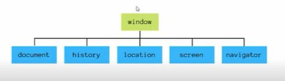

# AULA 1 - ENTENDENDO O D.O.M
## O que é:
Document Object Model. O DOM HTML é um padrão de como acessar e modificar os elementos HTML de uma página.

## DOM vs BOM:
BOM - Browser Object Model: É tudo o que está dentro do objeto window.
O DOM é um dos filhos do BOM.

;

# AULA 2 - SELECIONANDO ELEMENTOS
# AULA 3 - TRABALHANDO COM ESTILOS
# AULA 4 - EVENTOS