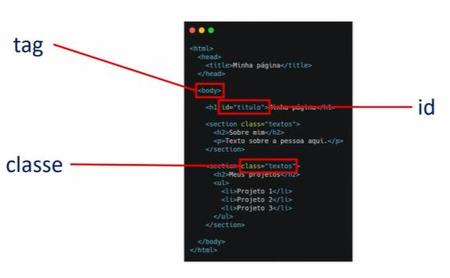
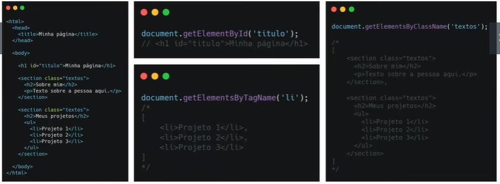
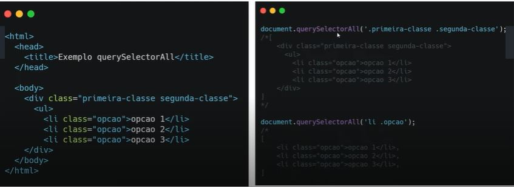

# AULA 1 - ENTENDENDO O D.O.M
## O que é:
Document Object Model. O DOM HTML é um padrão de como acessar e modificar os elementos HTML de uma página.

## DOM vs BOM:
BOM - Browser Object Model: É tudo o que está dentro do objeto window.
O DOM é um dos filhos do BOM.

;

---

# AULA 2 - SELECIONANDO ELEMENTOS
Estrutura HTML:

Selecionando os elementos de uma página:

Adicionar e deletar:

| Método | Descrição |
| --- | --- |
| document.createElement(element) | cria um novo elemento HTML |
| document.removeChild(element) | remove um elemento |
| document.appendChild(element) | adiciona um elemento |
| document.replaceChild(new, old) | substitui um elemento |

# AULA 3 - TRABALHANDO COM ESTILOS
# AULA 4 - EVENTOS