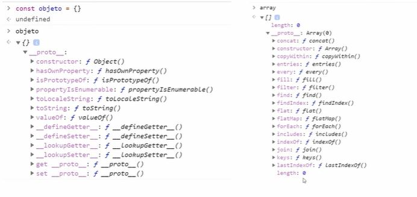
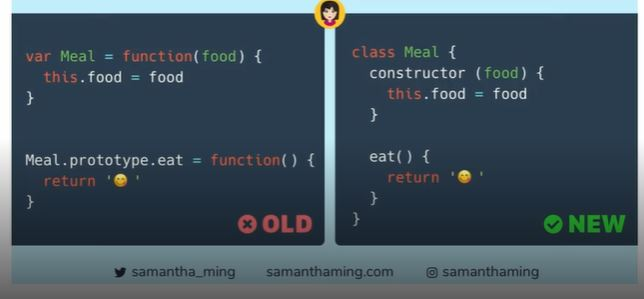
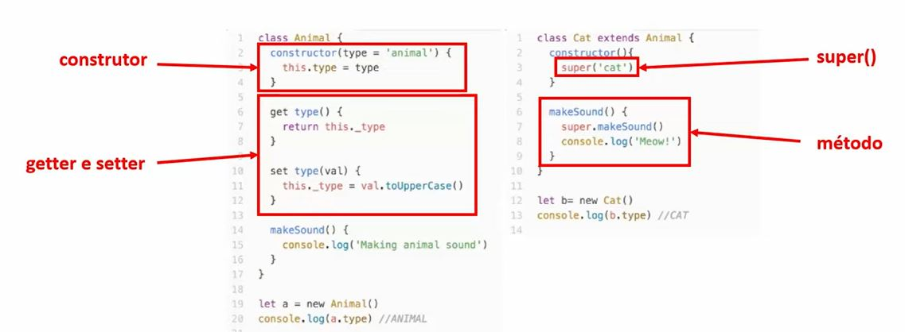

# AULA 1 - PARADIGMAS E PILARES
## Paradigmas
Paradigms:
  - Imperative: foca em como resolver os problemas
    - Procedural
    - Object Oriented
    - Parallel Processing

  - Declarative: o que será feito para resolver os problemas
    - Logic
    - Funcional
    - Database

Paradigmas -> Os programas são "objetos" que possuem uma série de propriedades.

## Pilares
Pilares:
 - Herança,
 - Polimorfismo 
 - Encapsulamento
 - Abstração

### Abstração:
Processo mental que consiste em isolar um aspecto determinado de um estado de coisas relativamente complexo, a fim de simplificar a sua avaliação, classificação ou para permitr a comunicação do mesmo

### Herança
O ojeto filho herda propridades e métodos do objeto pai.

### Polimorfismo:
Objetos podem herdar a mesma classe pai, mas se comportarem de forma diferente quando invocamos seus métodos

### Encapsulamento:
Cada classe tem propriedades e métodos independentes do restante do código

---

# AULA 2 - PROTÓTIPOS E CLASSES
## Protótipos
Todos os objetos JavaScript herdam propriedades e métodos de um prototype. O objeto Object.prototype está no topo desta cadeia;

## Classes
Syntatic sugas: uma sintaxe feita para facilitar a escrita

O javaScript não possui classes nativamente. Todas as classes são objetos e a herança se dá por protótipos

