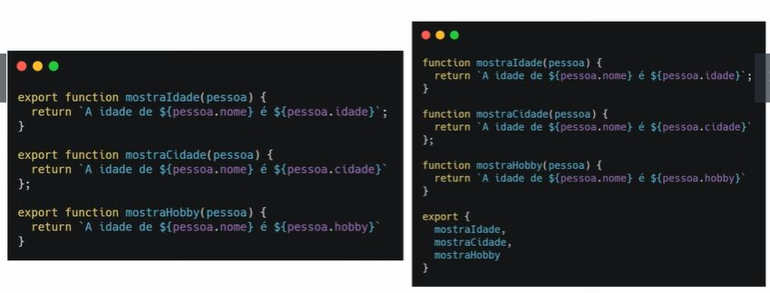
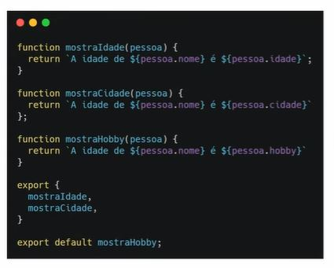
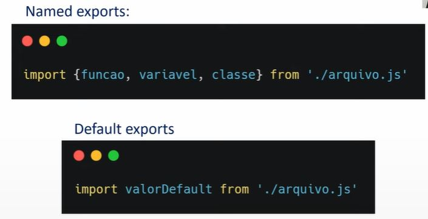
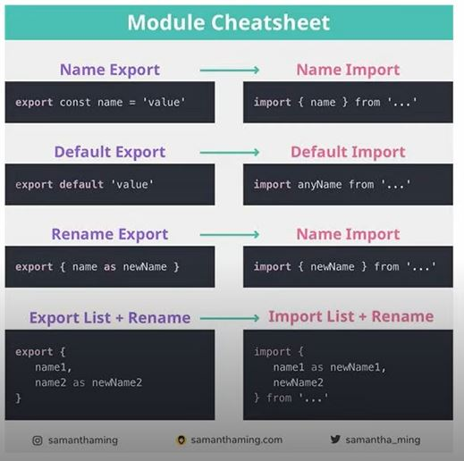

# AULA 01 - UTILIZANDO MÓDULOS:
## O que são módulos
Modulos arquivos JavaScript que tem a capacidade de exportar e importar informações de outros arquivos do mesmo tipo

Vantagens:
 - Organização do código
 - Compartilhamento de variáveis em escopos diferentes
 - Explicita as dependências dos arquivos


## Exportar:
 - Named exports
 Utilizado quando desejamos exportar mais de uma coisa

 


- Default exports
Só pode haver um por arquivo. Será o retorno padrão do seu arquivo.




## Importar:


Trocando nome de imports:

```
import {arquivo as Apelido} from './arquivo.js';

Apelido.metodo();
```

Importando todos os dados de um arquivo:

```
import * as INFOS from './arquivo.js';

INOFS.metodoA();
console.log(INFOS.variavel);
```

## Vinculando ao HTML:
```
<script type="module" src="./main.js"></script>
```

Para fazer testes localmente (de um arquivo no computador), será necessário estar rodando um servidor. Isso pode ser feito utilizando a extensão 'Live Server' do VSCode.


## Curiosidades:
- Módulos sempre estão em "strict mode";
- Podem ser utilizadas as extensões .js e .mjs;
- Para testes locais, é necessário utilizar um servidor;
- Ao importar, sempre lembre da extensão (.js , .mjs);
- Ao importar, sempre utilize "./" como ponto de partida


